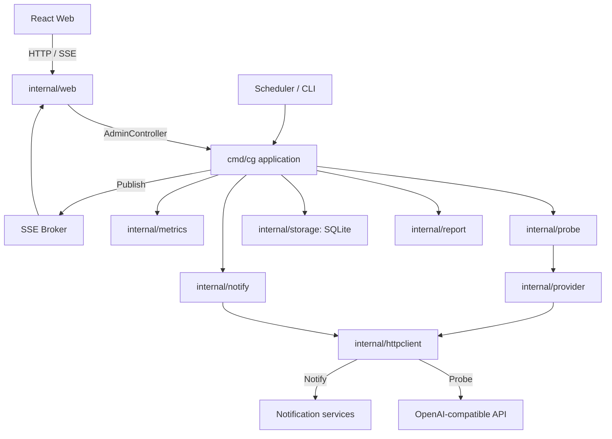

# 系统架构

[项目首页](../README.md) · [文档索引](README.md) · [开发指南](development.md) · [数据存储](data-storage.md)

本文介绍模块职责和关键流程。HTTP 协议见 [API 参考](api.md)，运行参数见[配置参考](configuration.md)。

## 概览



后端运行在单个进程内，使用本地 SQLite，无需独立数据库或队列。上游模型与通知服务通过网络访问，单次检测会产生真实调用。

## 目录结构

```text
cmd/cg/              程序入口
  main.go            application：配置、调度、HTTP 生命周期
  users.go           初始管理员与旧版 Token 迁移
internal/auth/       用户名/密码规则、密码哈希与校验
internal/config/     进程环境变量解析、运行时配置模型与校验
internal/provider/   OpenAI 兼容 / Anthropic / Gemini 协议适配、用量与图标映射
internal/probe/      探测编排（收集目标 → 并发探测 → 结果）
internal/report/     报告构建、历史裁剪、延迟统计、SVG 曲线
internal/notify/     告警客户端与过滤、告警状态
internal/storage/    SQLite 持久化、账号/会话、用量聚合、文件权限
internal/web/        HTTP 服务、SSE Broker、Cookie/CSRF/角色授权、静态托管
internal/metrics/    Prometheus 注册表与指标
internal/httpclient/ 安全 HTTP 客户端（DNS 校验 / 禁止重定向）
frontend/            React + TypeScript + Vite 源码
web/                 前端构建产物（Go 直接托管，已提交到仓库）
docs/                本目录
```

## 核心概念

| 概念 | 说明 |
|------|------|
| Provider | 一个模型服务（base_url + api_key + 模型列表 + 显式探测协议） |
| Model | Provider 下的一个模型，探测的最小单位 |
| Target | `Provider × Model` 组合，探测任务单元 |
| Result | 单次探测结果（状态、延迟、预览、错误、token 用量） |
| Report | 一次检测的完整快照，按 Provider 分组并附统计 |
| Task | 一次检测运行记录（manual / scheduled / startup / provider） |

## 启动流程

入口为 [cmd/cg/main.go](../cmd/cg/main.go)：

1. 单独的 `--version` / `version` 直接输出构建信息，不读取配置或打开数据库。
2. `config.Load()` 读取进程环境变量与默认值；`healthcheck` 请求本机健康接口后退出，不打开数据库。
3. 打开 SQLite；若为 `recover-admin`，执行离线恢复后退出。
4. 正常启动将遗留的 `running` 任务标记为 `canceled`，加载 SQLite 运行配置；不存在时写入初始化配置。
5. 校验设置与 Provider，补齐连接版本；非法配置使启动失败，不静默忽略。
6. 初始化账号：保留已有用户，否则按环境密码、符合规则的旧凭据、随机密码的顺序创建管理员并要求改密。
7. `check` / `once` 执行一次检测后退出；`serve`（默认）进入常驻模式。
8. 按配置启动首次检测、调度器与 HTTP 服务，注册指标。
9. 收到退出信号后拒绝新任务，取消检测，在 5 秒总宽限期内等待后台收尾并关闭服务与数据库。

账号创建与旧 Token KV 删除在同一事务内完成，后续认证只接受账号会话。

## 检测流程

```text
触发源：HTTP(manual) / 调度器(scheduled) / 启动(startup) / 单 Provider(provider)
        │
        ▼
application.StartCheck（HTTP 202）/ checkWithOptions（CLI、调度）
   ├─ 抢占 running 标志（已有任务 → ErrCheckAlreadyRunning → HTTP 409）
   ├─ 创建 check_tasks 记录（status=running）
   ├─ probe.Runner.Run
   │     ├─ collectTargets：逐 Provider 拉 /models（超时 MODEL_LIST_TIMEOUT_SECONDS）
   │     │     └─ 失败/空列表 → ProviderError（仍生成 DEGRADED 报告）
   │     ├─ 去重、应用 SKIP_MODELS、MAX_MODELS_PER_PROVIDER 截断
   │     └─ probeTargets：先获取单 Provider 信号量，再获取全局信号量（CONCURRENCY）
   │           └─ probeOne：按显式协议请求，应用全局或 Provider 超时
   │                 ├─ 延迟 ≥ SLOW_THRESHOLD_MS → slow
   │                 └─ 剥离 <think>/<thinking> 后校验非空；拒绝缺失消息与长度截断，成功时取前 80 字符为预览
   ├─ 模型发现失败：为上次报告中仍符合配置的已知模型补 unknown 记录
   ├─ 载入历史（EnableHistory 时）→ report.Build 生成报告
   ├─ 单 Provider 重跑：report.MergeProvider 合并进上一次完整报告
   ├─ 写库（历史 + 用量 + 最新报告，同一事务）
   ├─ Broker.Publish（SSE 推送）
   ├─ notify.SendIfNeeded（状态变化才发）
   └─ 完成 check_tasks（success / error / canceled）
```

HTTP 接受任务后用服务端独立上下文执行，断开连接不会取消；最长运行 30 分钟，停服会取消并等待收尾。取消时不更新最新报告、历史或告警，已确认响应的用量使用独立上下文保存。管理员可通过概览进度或停止 API 取消任务。

配置更新与最新快照写入通过 `configMu` 串行化；`report.WithConfig` 将报告投影到当前启用的 Provider/模型，删除或停用立即反映到持久快照和 SSE，防止在途检测把已删除项目重新放回监控页。

## 状态模型

| 状态 | 触发条件 | 展示 |
|------|----------|------|
| `ok` | 请求成功且延迟 < `SLOW_THRESHOLD_MS` | 正常（绿） |
| `slow` | 请求成功且延迟 ≥ `SLOW_THRESHOLD_MS` | 较慢（黄） |
| `error` | 请求失败/超时/解析失败 | 异常（红） |
| `unknown` | 无当前有效检测证据，如新增配置、连接变更或发现失败 | 未检测（灰） |
| `paused` | `ENABLED=true` 且 `PROBE_ENABLED=false` | 已暂停（黄） |

- Provider 状态：暂停时为 `paused`；否则依次检查明确错误、未检测或空模型结果、较慢响应，分别为 `error`、`unknown`、`slow`，其余为 `ok`。
- 全局状态：存在 error、unknown 或 Provider 级错误时为 `DEGRADED`，否则为 `OPERATIONAL`。界面还需优先识别 `state=unconfigured/pending`，不能把空态当作请求失败。
- `unknown` 不证明聊天接口已故障。模型发现失败生成的历史样本计入成功率分母，但新增配置或连接变化的状态投影不会凭空增加历史、调用次数或用量。
- 报告 `generated_at` 与模型/Provider `checked_at` 使用 UTC RFC3339。单 Provider 重测保留其他 Provider 原时间，任务计数只统计实际重测目标。

通知使用独立的范围与状态计算，未知且无检测证据的 Provider 不应触发恢复通知，详见[告警通知](configuration.md#告警通知)。

## 实时推送

`web.Broker` 维护订阅者 channel 集合（`internal/web/server.go`）：

- `GET /api/events` 建立 SSE，先补发一次当前最新报告；
- 每次检测完成 `Publish`，各订阅者非阻塞投递（缓冲满则用新报告替换旧报告，避免慢客户端拖慢检测）；
- 公开读取和 SSE 推送都按当前错误详情开关过滤；修改设置后会重新推送已有报告，无需等待检测；
- 每 5 秒发 `: keep-alive` 注释帧；每次发送报告和心跳前按当前 `status_login_required` 检查会话，失效则推送 `auth-required` 后断开；
- 前端 `EventSource` 不可用或出错时，指数退避轮询 `/api/status`（30s → 60s → 120s）。

## 配置优先级

默认值和环境变量形成基础配置，SQLite 中已保存的运行设置与 Provider 覆盖同名值。管理面板和配置导入更新 SQLite，并立即应用至运行状态。

监听地址、静态/数据路径、`SECURE_COOKIES`、探测提示词及 `AUTO_CHECK_RUN_ON_START` 只在启动时读取，变更需重启。环境账号密码仅用于初次创建管理员。字段归属见[配置优先级](configuration.md#配置优先级)与[运行时修改](configuration.md#运行时修改与重启)。
